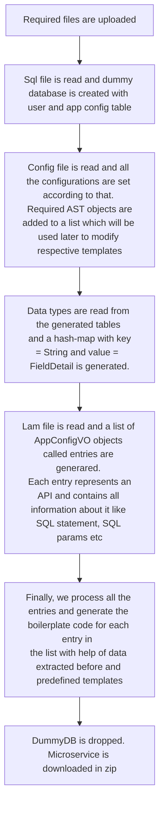

## What is Laminar?
Laminar generates your gRPC microservice with the required production-grade boilerplate code in GoLang. Laminar helps you to save a lot of development time and effort. All you need to do is just upload the three required files and the laminar will bless you with the microservice in a ZIP file. This can be extracted and run with some minor changes in configs. Someone with just the knowledge of SQL and GoLang can easily generate a gRPC microservice using Laminar!

## How was Laminar born?
While building a team at nurture.farm, Abinasha Karana was stuck in the familiar dilemma of having a modern stack that supports gRPC, Kubernetes, and goLang using microservices architecture while hiring talented engineers remained a big problem. 

To overcome this, he envisioned automating generating code that supports the modern stack and leaves just writing application code to the engineers. nurture.farm leveraged this to quickly scale to many microservices in a very short span of time. Standardizing the code also meant that the chances of errors were reduced automatically and a lot less time was spent on boilerplate code.

The elevator pitch for laminar is - "We just need to write MySQL query and voila, you have a running microservice."

The vision is to support more databases in the future through standard language to define contracts and entities. 

## What are the advantages of using Laminar?

* Automates boilerplate code
* Creates microservices using golang, gRPC, MySQL with a minimum learning curve
* Quickly upgrades the code by standardizing contracts of generated code with the application layer

### How does Laminar generates your code?

## Table of Contents
1. [Required Dependencies](https://github.com/nurture-farm/laminarb/wiki/Required-Dependencies)
2. [Quickstart Guide](https://github.com/nurture-farm/laminar/wiki/Quickstart-Guide)
3. [Example input files with explanation](https://github.com/nurture-farm/laminar/wiki/Example-input-files-with-explanation)
4. [Example Generated Service](https://github.com/nurture-farm/laminar/wiki/Example-Generated-Service)
5. [Example Generated Files](https://github.com/nurture-farm/laminar/wiki/Example-Generated-Files)
6. [Overview of generated files by Laminar](https://github.com/nurture-farm/laminar/wiki/Overview-of-Generated-Files-by-Laminar)
7. [Deploying your Microservice](https://github.com/nurture-farm/laminar/wiki/Deploying-your-Microservice)
8. [More things you can do with Laminar with examples](https://github.com/nurture-farm/laminar/wiki/More-things-you-can-do-with-Laminar-with-examples)
9. [How to Run Laminar in Local](https://github.com/nurture-farm/laminar/wiki/How-to-Run-Laminar-in-Local)
10. [Architecture](https://github.com/nurture-farm/laminar/wiki/Architecture)
11. [How to Contribute](https://github.com/nurture-farm/laminar/wiki/How-to-Contribute)
12. [Credits](https://github.com/nurture-farm/laminar/wiki/Credits)

